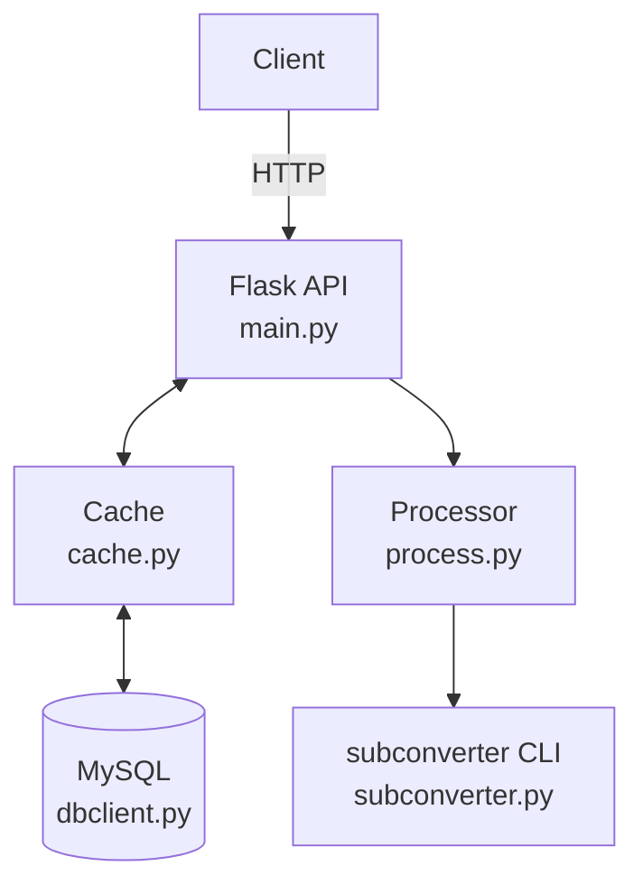

# Proxy Manager

一个基于 Flask + Uvicorn 的订阅管理服务：从原始代理列表拉取、解析、分片、转换为多种目标格式，并缓存到 MySQL，提供订阅与管理 API。

## 主要功能

1. 拉取原始代理（`RAW_PROXIES_LINK`）并分片处理。
2. 支持多目标格式转换：`clash`、`v2ray`、`mixed`、`singbox`、`quanx`、`surge`、`loon`。
3. 分片结果写入 MySQL + 内存缓存（Copy-on-Write 读写分离）。
4. 订阅接口自动根据 User-Agent 识别客户端类型。
5. 可选的 GitHub Actions IP/域名屏蔽（从 GitHub Meta API 定期刷新）。
6. 支持只读 / 写入授权校验，支持过期提示订阅。

## 架构与数据流

```
Client
  |  HTTP
  v
Flask API (main.py)  <->  Cache (cache.py)
  |                        |
  |                        v
  |                  MySQL (dbclient.py)
  v
Processor (process.py)  ->  subconverter (subconverter.py)
```



1. API 层：`main.py` 提供 HTTP 接口，使用 Flask 路由，Uvicorn 承载 WSGI 应用。
2. 任务处理：`process.py` 负责分片、并发转换、状态管理。
3. 转换引擎：`subconverter.py` 封装 `subconverter` CLI 的配置与执行。
4. 缓存层：`cache.py` 采用 Copy-on-Write，读无锁，写入切换引用。
5. 存储层：`dbclient.py` + `connpool.py` 提供 MySQL 连接池与 CRUD。
6. 防爬/屏蔽：`blacklist.py` 定期从 GitHub Meta 更新 Actions IP/域名并判断访问方。
7. 配置层：`settings.py` 读取环境变量并提供统一配置入口。

## 工作流程

### 订阅请求流程（`/api/v1/subscribe`）

1. 校验 `token`，若失败且设置了 `EXPIRED_WARNING`，返回过期提示分片。
2. 若开启 `BAN_GITHUB_IP`，基于 IP/Host 判定并拦截 GitHub Actions 流量。
3. 解析 `target`，未传时根据 `User-Agent` 自动识别客户端类型。
4. 确定 `partition`，未指定时从缓存/数据库获取可用分片并随机选择。
5. 从缓存读取内容，缓存未命中则查询数据库并异步回写缓存。
6. 返回订阅内容并附带 `Subscription-Userinfo` 头部信息。

### 分片任务流程（`/api/v1/partition/submit`）

1. 拉取 `RAW_PROXIES_LINK` 原始内容，失败会指数退避重试。
2. 解码并规范化为代理节点列表，可选过滤/改名/前后缀处理。
3. 按 `MAX_PROXIES_SIZE` 分片，必要时合并尾部分片。
4. 对每个分片、目标类型、规则开关并发执行转换任务。
5. 写入 MySQL，完成后刷新缓存，并清理超出分片数量的历史数据。

## 环境依赖

1. Python 3.10+（Docker 镜像为 Python 3.12）
2. MySQL 5.7+/8.0+
3. `subconverter` 可执行文件已在 `subconverter/` 目录中提供

依赖包见 `requirements.txt`。

## 快速开始（本地）

1. 安装依赖

```bash
pip install -r requirements.txt
```

2. 设置环境变量（示例使用 PowerShell）

```powershell
$env:RAW_PROXIES_LINK="https://example.com/proxies.txt"
$env:SUPPORTED_TARGRTS="clash,v2ray,mixed"
$env:DB_HOST="127.0.0.1"
$env:DB_USERNAME="root"
$env:DB_PASSWORD="your_password"
$env:DB_DATABASE="proxies"
```

3. 启动服务

```bash
python -u main.py
```

默认端口为 `7860`，可通过 `SERVER_PORT` 修改。

注意：项目只读取系统环境变量，不会自动加载 `.env` 文件。若需使用 `.env`，请在启动前自行导入。

## 快速开始（Docker）

```bash
docker build -t proxy-manager:latest .
docker run -d --name proxy-manager \
  -e RAW_PROXIES_LINK="https://example.com/proxies.txt" \
  -e SUPPORTED_TARGRTS="clash,v2ray,mixed" \
  -e DB_HOST="your-db-host" \
  -e DB_USERNAME="root" \
  -e DB_PASSWORD="your_password" \
  -e DB_DATABASE="proxies" \
  -p 7860:7860 \
  proxy-manager:latest
```

Dockerfile 中预设了一组默认环境变量（例如 `CACHE_REFRESH_INTERVAL=14400`），若需要覆盖请自行传入 `-e`。

## 配置说明（环境变量）

以下为代码默认值（Dockerfile 可能覆盖部分默认值）：

1. `MAX_RETRIES`：`3`，拉取原始代理失败的最大重试次数
2. `MAX_WAIT`：`10`，重试最大等待秒数（指数退避上限）
3. `MAX_PROXIES_SIZE`：`150`，每个分片最大节点数
4. `RAW_PROXIES_LINK`：空，原始代理链接（必填）
5. `SUPPORTED_TARGRTS`：空，支持的目标类型，逗号分隔
6. `WRITE_AUTHORIZATION_KEY`：空，写入接口鉴权
7. `READ_AUTHORIZATION_KEY`：空，订阅接口鉴权
8. `CACHE_REFRESH_INTERVAL`：`3600`，缓存刷新间隔（秒）
9. `SERVER_PORT`：`7860`，服务端口
10. `ADDITIONAL_PREFIX`：空，节点名称前缀
11. `ADDITIONAL_SUFFIX`：空，节点名称后缀
12. `CLOUDFLARE_POLICY`：`0`，Cloudflare 节点处理
13. `DB_HOST`：`127.0.0.1`
14. `DB_PORT`：`3306`
15. `DB_USERNAME`：`root`
16. `DB_PASSWORD`：空
17. `DB_DATABASE`：`proxies`
18. `DB_TABLENAME`：`public`
19. `DB_MIN_CACHED`：`1`
20. `DB_MAX_CACHED`：`0`
21. `DB_MAX_SHARED`：`10`
22. `DB_MAX_CONNECYIONS`：`300`
23. `DB_BLOCKING`：`True`
24. `DB_MAX_USAGE`：`0`
25. `DB_SET_SESSION`：`None`
26. `REDIRECT_URL`：空，订阅鉴权失败重定向
27. `INSERT_URL`：`false`，是否让 subconverter 插入默认节点
28. `FILTER_CN`：`false`，过滤中国节点
29. `EXPIRED_WARNING`：空，过期提示节点名称
30. `PARTITION_THREAD_NUM`：`-1`，并行转换线程数（<=0 表示自动）
31. `BAN_GITHUB_IP`：`false`，屏蔽 GitHub Actions IP
32. `GITHUB_META_URL`：`https://api.github.com/meta`
33. `GITHUB_META_CACHE_FILE`：`github-ip-ranges.json`
34. `GITHUB_META_REFRESH_INTERVAL`：`86400`
35. `GITHUB_META_TIMEOUT`：`60`

Cloudflare 策略 `CLOUDFLARE_POLICY`：

1. `0`：不处理
2. `1`：匹配到 Cloudflare/Google 的节点改名为固定名称
3. `2`：丢弃这些节点

## API 接口

### `POST /api/v1/partition/submit`

触发一次分片与转换任务。
当 `WRITE_AUTHORIZATION_KEY` 设置后，需要在请求头中提供：

```
Authorization: Bearer <WRITE_AUTHORIZATION_KEY>
```

返回示例：

```json
{"success": true, "code": 200, "message": "Partition operation started"}
```

### `GET /api/v1/partition/status`

查询当前或最近一次分片任务状态。

### `GET /api/v1/subscribe`

订阅接口，参数如下：

1. `token`：当 `READ_AUTHORIZATION_KEY` 设置时必须提供
2. `target`：目标类型，如 `clash`、`v2ray`、`mixed`
3. `partition`：分片编号，不传则随机选择
4. `list`：`true/1` 表示返回无规则版本

行为说明：

1. 未提供 `target` 时，会根据 `User-Agent` 自动识别
2. 若 `token` 无效且 `EXPIRED_WARNING` 设置，会返回“过期提示”的分片内容
3. 当 `BAN_GITHUB_IP` 开启时，会根据 IP/Host 判断是否为 GitHub Actions 请求并拒绝

### `GET /api/v1/health`

健康检查，固定返回 `OK`。

## 数据库说明

启动时自动创建表（默认表名 `public`），结构见 `dbclient.py`。
核心字段包括：

1. `target`
2. `content`
3. `without_rules`
4. `partition`
5. `created_at` / `updated_at`

## 日志

日志输出到控制台和 `logs/proxy-manager.log`。

## 目录结构（关键文件）

1. `main.py`：API 入口
2. `process.py`：分片、转换、并发处理
3. `cache.py`：订阅缓存
4. `dbclient.py` / `connpool.py`：MySQL 访问与连接池
5. `blacklist.py`：GitHub Actions IP/域名屏蔽
6. `subconverter.py`：subconverter 适配封装
7. `settings.py`：配置读取

## 许可

见 `LICENSE.txt`。
