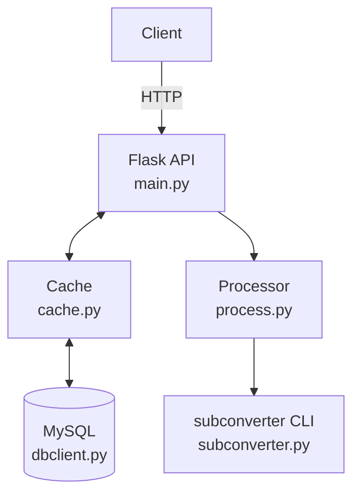

# Proxy Manager

A subscription management service based on Flask + Uvicorn: fetches raw proxy lists, parses, partitions, converts to multiple target formats, caches in MySQL, and exposes subscription and management APIs.

## Key Features

1. Fetch raw proxies (`RAW_PROXIES_LINK`) and process in partitions.
2. Multi-target conversion: `clash`, `v2ray`, `mixed`, `singbox`, `quanx`, `surge`, `loon`.
3. Partition results stored in MySQL + in-memory cache (Copy-on-Write read/write separation).
4. Subscription endpoint auto-detects client type by User-Agent.
5. Optional GitHub Actions IP/host blocking (periodically refreshed from GitHub Meta API).
6. Read-only / write authorization checks, with optional expired-subscription hint.

## Architecture and Data Flow

```
Client
  |  HTTP
  v
Flask API (main.py)  <->  Cache (cache.py)
  |                        |
  |                        v
  |                  MySQL (dbclient.py)
  v
Processor (process.py)  ->  subconverter (subconverter.py)
```



1. API layer: `main.py` provides HTTP endpoints using Flask routes; Uvicorn serves the WSGI app.
2. Task processing: `process.py` handles partitioning, concurrent conversion, and status management.
3. Conversion engine: `subconverter.py` wraps configuration and execution of the `subconverter` CLI.
4. Cache layer: `cache.py` uses Copy-on-Write for lock-free reads and switched writes.
5. Storage layer: `dbclient.py` + `connpool.py` provide MySQL pool and CRUD.
6. Anti-crawl / blocking: `blacklist.py` periodically pulls GitHub Meta Actions IP/hosts and checks request origin.
7. Config layer: `settings.py` reads environment variables and exposes unified config.

## Workflow

### Subscription request flow (`/api/v1/subscribe`)

1. Validate `token`; if invalid and `EXPIRED_WARNING` is set, return an expired-warning partition.
2. If `BAN_GITHUB_IP` is enabled, block GitHub Actions traffic by IP/Host.
3. Parse `target`; if missing, infer client type from `User-Agent`.
4. Determine `partition`; if not specified, select an available partition from cache/DB at random.
5. Read from cache; on miss, query DB and asynchronously refresh cache.
6. Return subscription content and include `Subscription-Userinfo` header.

### Partition task flow (`/api/v1/partition/submit`)

1. Fetch `RAW_PROXIES_LINK`; on failure, retry with exponential backoff.
2. Decode and normalize into a proxy node list; optional filtering/renaming/prefix/suffix.
3. Partition by `MAX_PROXIES_SIZE`, merging tail partitions when necessary.
4. For each partition, target type, and rule flag, run conversions concurrently.
5. Write to MySQL, refresh cache, and clean up historical data beyond partition count.

## Environment Requirements

1. Python 3.10+ (Docker image uses Python 3.12)
2. MySQL 5.7+/8.0+
3. `subconverter` binary is provided in the `subconverter/` directory

Dependencies are listed in `requirements.txt`.

## Quick Start (Local)

1. Install dependencies

```bash
pip install -r requirements.txt
```

2. Set environment variables (PowerShell example)

```powershell
$env:RAW_PROXIES_LINK="https://example.com/proxies.txt"
$env:SUPPORTED_TARGRTS="clash,v2ray,mixed"
$env:DB_HOST="127.0.0.1"
$env:DB_USERNAME="root"
$env:DB_PASSWORD="your_password"
$env:DB_DATABASE="proxies"
```

3. Start the service

```bash
python -u main.py
```

Default port is `7860`, configurable via `SERVER_PORT`.

Note: The project only reads system environment variables and does not auto-load `.env`. If you need `.env`, import it before launch.

## Quick Start (Docker)

```bash
docker build -t proxy-manager:latest .
docker run -d --name proxy-manager \
  -e RAW_PROXIES_LINK="https://example.com/proxies.txt" \
  -e SUPPORTED_TARGRTS="clash,v2ray,mixed" \
  -e DB_HOST="your-db-host" \
  -e DB_USERNAME="root" \
  -e DB_PASSWORD="your_password" \
  -e DB_DATABASE="proxies" \
  -p 7860:7860 \
  proxy-manager:latest
```

The Dockerfile sets some default environment variables (for example, `CACHE_REFRESH_INTERVAL=14400`). Override them with `-e` as needed.

## Configuration (Environment Variables)

Defaults from code (Dockerfile may override some defaults):

1. `MAX_RETRIES`: `3`, max retries for fetching raw proxies
2. `MAX_WAIT`: `10`, max wait seconds for retries (backoff cap)
3. `MAX_PROXIES_SIZE`: `150`, max nodes per partition
4. `RAW_PROXIES_LINK`: empty, raw proxy URL (required)
5. `SUPPORTED_TARGRTS`: empty, supported target types, comma-separated
6. `WRITE_AUTHORIZATION_KEY`: empty, write API auth
7. `READ_AUTHORIZATION_KEY`: empty, subscribe API auth
8. `CACHE_REFRESH_INTERVAL`: `3600`, cache refresh interval (seconds)
9. `SERVER_PORT`: `7860`, server port
10. `ADDITIONAL_PREFIX`: empty, node name prefix
11. `ADDITIONAL_SUFFIX`: empty, node name suffix
12. `CLOUDFLARE_POLICY`: `0`, Cloudflare node handling
13. `DB_HOST`: `127.0.0.1`
14. `DB_PORT`: `3306`
15. `DB_USERNAME`: `root`
16. `DB_PASSWORD`: empty
17. `DB_DATABASE`: `proxies`
18. `DB_TABLENAME`: `public`
19. `DB_MIN_CACHED`: `1`
20. `DB_MAX_CACHED`: `0`
21. `DB_MAX_SHARED`: `10`
22. `DB_MAX_CONNECYIONS`: `300`
23. `DB_BLOCKING`: `True`
24. `DB_MAX_USAGE`: `0`
25. `DB_SET_SESSION`: `None`
26. `REDIRECT_URL`: empty, redirect on auth failure
27. `INSERT_URL`: `false`, whether subconverter inserts default nodes
28. `FILTER_CN`: `false`, filter China nodes
29. `EXPIRED_WARNING`: empty, expired warning node name
30. `PARTITION_THREAD_NUM`: `-1`, conversion thread count (<=0 means auto)
31. `BAN_GITHUB_IP`: `false`, block GitHub Actions IPs
32. `GITHUB_META_URL`: `https://api.github.com/meta`
33. `GITHUB_META_CACHE_FILE`: `github-ip-ranges.json`
34. `GITHUB_META_REFRESH_INTERVAL`: `86400`
35. `GITHUB_META_TIMEOUT`: `60`

Cloudflare policy `CLOUDFLARE_POLICY`:

1. `0`: no handling
2. `1`: rename Cloudflare/Google nodes to a fixed name
3. `2`: drop those nodes

## API Endpoints

### `POST /api/v1/partition/submit`

Triggers a partition and conversion task.
When `WRITE_AUTHORIZATION_KEY` is set, include:

```
Authorization: Bearer <WRITE_AUTHORIZATION_KEY>
```

Response example:

```json
{"success": true, "code": 200, "message": "Partition operation started"}
```

### `GET /api/v1/partition/status`

Query the current or latest partition task status.

### `GET /api/v1/subscribe`

Subscription endpoint parameters:

1. `token`: required when `READ_AUTHORIZATION_KEY` is set
2. `target`: target type, e.g. `clash`, `v2ray`, `mixed`
3. `partition`: partition index; random if omitted
4. `list`: `true/1` returns a rule-free version

Behavior:

1. If `target` is missing, auto-detect from `User-Agent`
2. If `token` is invalid and `EXPIRED_WARNING` is set, return the expired-warning partition
3. If `BAN_GITHUB_IP` is enabled, block requests identified as GitHub Actions by IP/Host

### `GET /api/v1/health`

Health check, always returns `OK`.

## Database

Tables are auto-created at startup (default table name `public`); schema lives in `dbclient.py`.
Core fields include:

1. `target`
2. `content`
3. `without_rules`
4. `partition`
5. `created_at` / `updated_at`

## Logs

Logs are written to console and `logs/proxy-manager.log`.

## Project Structure (Key Files)

1. `main.py`: API entry
2. `process.py`: partitioning, conversion, concurrency
3. `cache.py`: subscription cache
4. `dbclient.py` / `connpool.py`: MySQL access and pool
5. `blacklist.py`: GitHub Actions IP/host blocking
6. `subconverter.py`: subconverter adapter
7. `settings.py`: config loading

## License

See `LICENSE.txt`.
